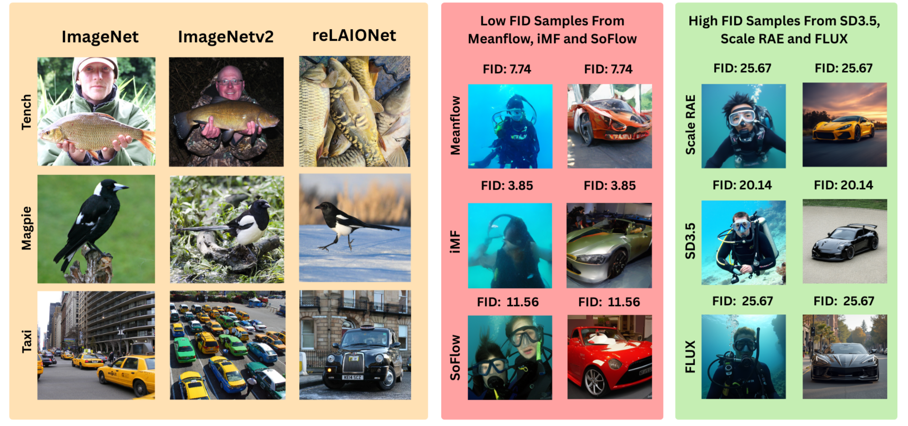

# Fair Benchmarking of Emerging One-Step Generative Models Against Multistep Diffusion and Flow Models



This is the official repository for Fair Benchmarking of Emerging One-Step Generative Models Against Multistep Diffusion and Flow Models.

\[[arXiv](https://arxiv.org/abs/2603.14186)\]


## 1. Overview

This repository provides standardized benchmarking pipelines for evaluating generative flow and diffusion models on image generation tasks. It supports multiple models and evaluation datasets, enabling reproducible comparisons across architectures.

Models currently supported:

- RAE
- Scale-RAE
- SiT
- SoFlow
- flux1
- iMeanFlow
- MeanFlow
- SD3.5-L


## 2. Dataset Downloads

### ImageNet (ILSVRC 2012)

Download the ImageNet ILSVRC 2012 validation set from the official source: [https://image-net.org/challenges/LSVRC/2012/](https://image-net.org/challenges/LSVRC/2012/)

### ImageNetV2

Download from Hugging Face: [https://huggingface.co/datasets/vaishaal/ImageNetV2](https://huggingface.co/datasets/vaishaal/ImageNetV2)

### ReLAIONet

Download from Hugging Face: [https://huggingface.co/datasets/harvardairobotics/reLAIONet](https://huggingface.co/datasets/harvardairobotics/reLAIONet)

---

## 3. Running Evaluations

### Repository structure

```
benchmark_flows/
├── src/
│   ├── RAE/
│   ├── Scale-RAE/
│   ├── SiT/
│   ├── SoFlow/
│   ├── flux1/
│   ├── imeanflow/
│   ├── meanflow/
│   └── SD3.5-L/
└── README.md
```

Each subfolder contains its own environment setup and inference scripts. To run evaluations for a specific model:

1. Navigate into the model's subfolder:
   ```bash
   cd src/<model-name>
   ```
2. Follow the setup and run instructions in the subfolder's `README.md`.


### MinMax Harmonic Mean (MMHM) Calculation

```bash
# Compute MMHM for an output csv
python src/scripts/compute_composite_score.py --input data/imagenet_results.csv --output data/imagenet_results_scored.csv

# Save the min/max bounds used for normalization and compute MMHM
python src/scripts/compute_composite_score.py --save-bounds data/imagenet_bounds.json

# Reuse previously saved bounds for MMHM (for generalization to new evaluation sets):
python src/scripts/compute_composite_score.py --input data/new_results.csv --reuse-bounds data/imagenet_bounds.json
```
